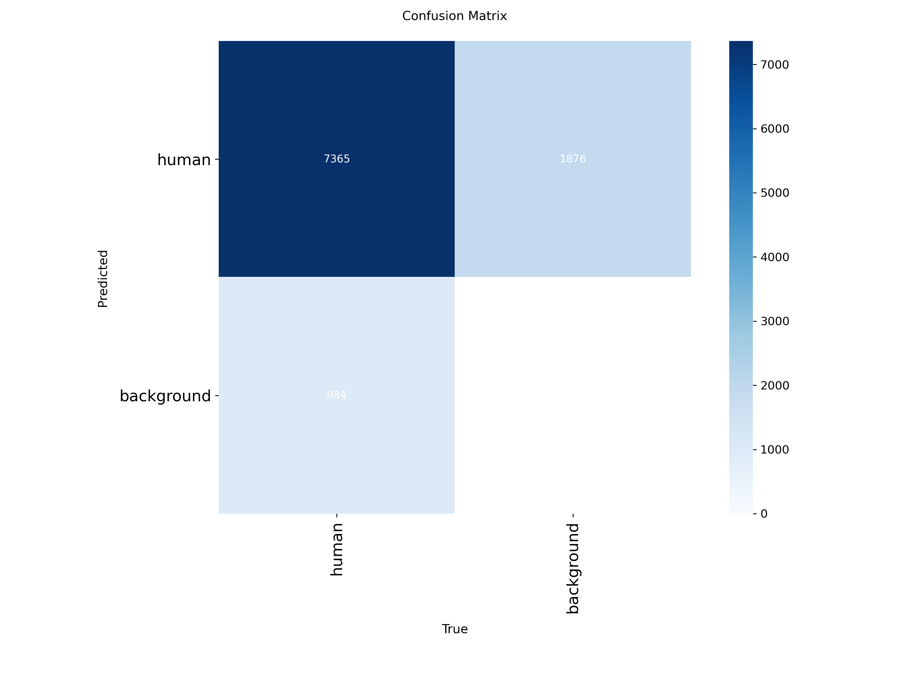
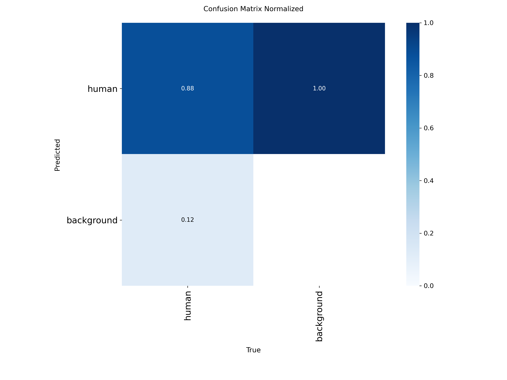
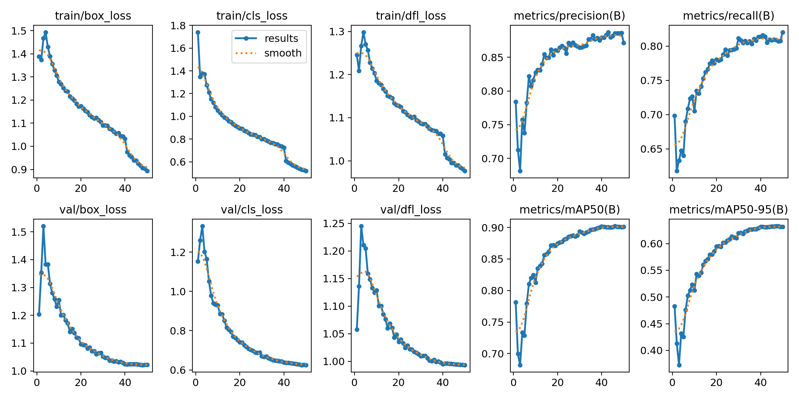
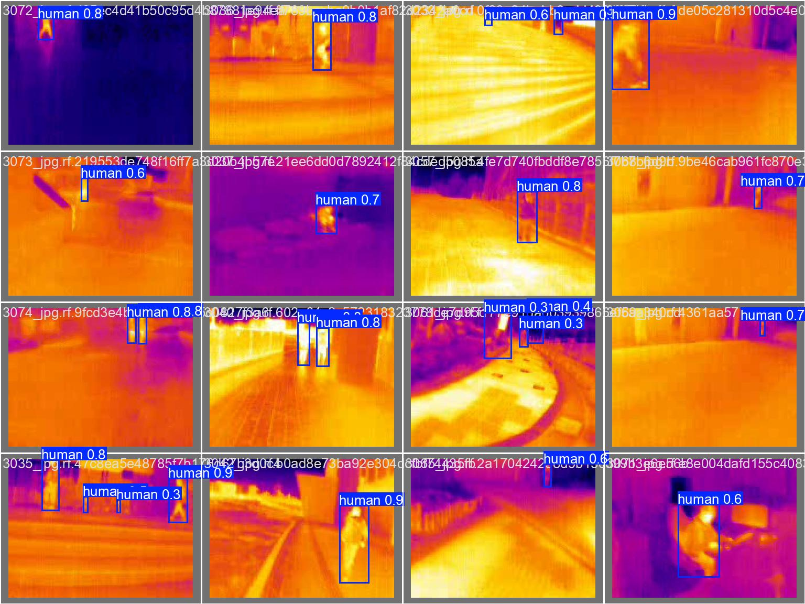
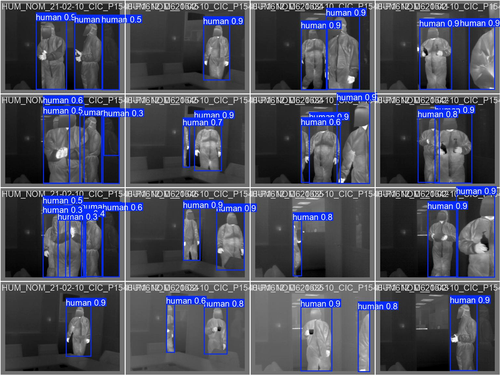
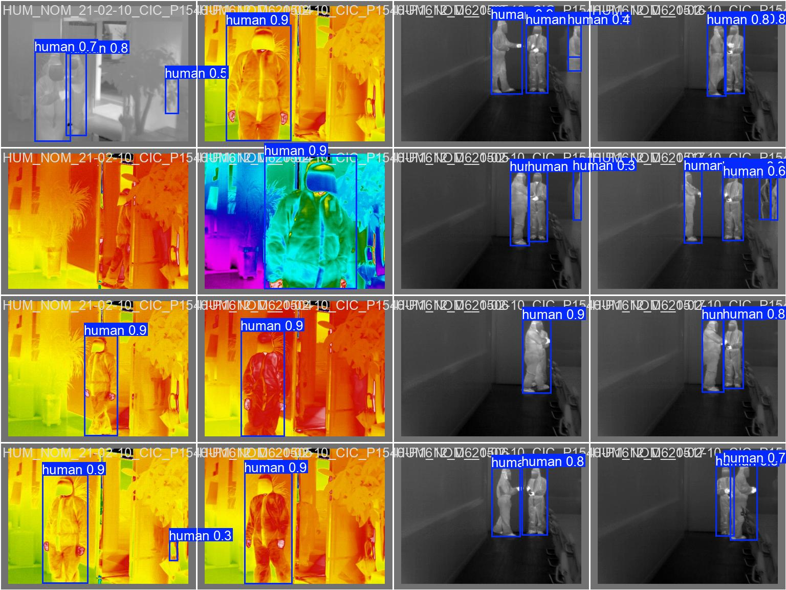

# ThermalOD

> **Thermal Object Detection with YOLOv11 Nano**

---

## 🚀 Overview

This repository contains a trained YOLOv11 nano model for thermal object detection. The model was trained and tested on **over 24,000 images** from diverse thermal imaging datasets, enabling robust detection of thermal subjects across various scenarios and conditions.

---

<details>
<summary><strong>📊 Model & Training Details (click to expand)</strong></summary>

- **Model:** YOLOv11 nano (`yolo11n.pt`)
- **Task:** Thermal Object Detection
- **Images:** 24,000+ (train/test split)
- **Image Size:** 640x640
- **Framework:** PyTorch
- **Classes:** Human detection in thermal imagery

</details>

---

## 🏆 Results & Visualizations

Below are some of the key results and visualizations generated during model evaluation:

| Confusion Matrix | Normalized Confusion Matrix | Results Curve |
|:---:|:---:|:---:|
|  |  |  |

### Sample Predictions

| Validation Batch 0 | Validation Batch 1 | Validation Batch 2 |
|:---:|:---:|:---:|
|  |  |  |

---

<details>
<summary><strong>📈 Training Metrics (click to expand)</strong></summary>

- See [`results.csv`](./ThermalOD_model/results.csv) for detailed epoch-wise metrics (loss, precision, recall, mAP, etc.)
- Example (final epoch):
  - **Precision:** 0.85
  - **Recall:** 0.78
  - **mAP@0.5:** 0.82
  - **mAP@0.5:0.95:** 0.65

</details>

---

## 🧩 Model Weights

- **Best Model:** [`weights/best.pt`](./ThermalOD_model/weights/best.pt)
- **Last Epoch Model:** [`weights/last.pt`](./ThermalOD_model/weights/last.pt)
- **ONNX Export:** [`weights/best.onnx`](./ThermalOD_model/weights/best.onnx)

> **Note:** These files are large. Download as needed for inference or further training.

---

## 🛠️ How to Use

1. **Clone the repository:**
   ```bash
   git clone https://github.com/pranayjoshi/ThermalOD.git
   cd ThermalOD
   ```

2. **Download model weights** (if not present):
   - Place them in the `ThermalOD_model/weights/` directory.

3. **Run inference:**
   ```python
   from ultralytics import YOLO
   
   # Load the model
   model = YOLO('ThermalOD_model/weights/best.pt')
   
   # Run inference
   results = model('path_to_your_image.jpg')
   ```

---

## 📚 Dataset Credits

The model was trained on multiple thermal imaging datasets:

1. **PersonDection Dataset** by SMART2
   - Source: [Roboflow Universe](https://universe.roboflow.com/smart2/persondection-61bc2)

2. **People Dataset** by scifair2324
   - Source: [Roboflow Universe](https://universe.roboflow.com/scifair2324/people-lajkn)

3. **PersonDection Dataset** by SMART
   - Source: [Roboflow Universe](https://universe.roboflow.com/smart-yjdj0/persondection)

4. **RemoteSurveillanceThermal Dataset** by RemoteSurveillance
   - Source: [Roboflow Universe](https://universe.roboflow.com/remotesurveillance-xy8vj/remotesurveillancethermal)

5. **Pedestrians Detection Dataset** by University
   - Source: [Roboflow Universe](https://universe.roboflow.com/university-a4j9h/pedestrians-detection-vatow)

---

## 📝 License

This project is licensed under the MIT License - see the [LICENSE](LICENSE) file for details.

---

> For questions or contributions, please open an issue or pull request!
